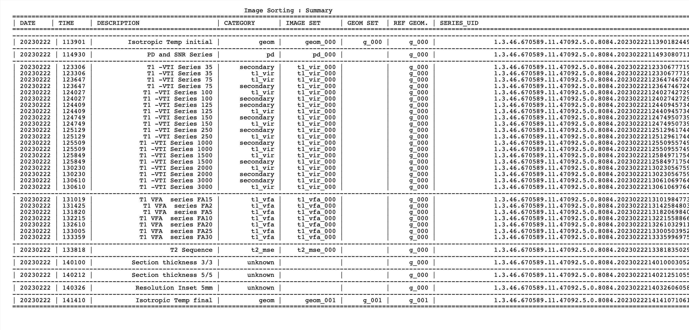

*Authors: Stanley Norris &nbsp;&nbsp;&nbsp;&nbsp;&nbsp;&nbsp;&nbsp;&nbsp;&nbsp;&nbsp;&nbsp;&nbsp;&nbsp;&nbsp;&nbsp;&nbsp;&nbsp;&nbsp;&nbsp;&nbsp;&nbsp;&nbsp;&nbsp;&nbsp;&nbsp;&nbsp;&nbsp;&nbsp;&nbsp;&nbsp;&nbsp;&nbsp;&nbsp;&nbsp;&nbsp;&nbsp;&nbsp;&nbsp;&nbsp;&nbsp;&nbsp;&nbsp;&nbsp;&nbsp;&nbsp;&nbsp;&nbsp;&nbsp;&nbsp;&nbsp;&nbsp;&nbsp;&nbsp;&nbsp;&nbsp;&nbsp;&nbsp;&nbsp;&nbsp;&nbsp;&nbsp;&nbsp;&nbsp;&nbsp;&nbsp;&nbsp;&nbsp;&nbsp;&nbsp;&nbsp;&nbsp;&nbsp;&nbsp;&nbsp;&nbsp;&nbsp;&nbsp;&nbsp;&nbsp;&nbsp;&nbsp;&nbsp;&nbsp;&nbsp;&nbsp;&nbsp; Date Modified: 10/10/2023*

# Tutorial: Adding a new scanner or acquisition protocol
This tutorial will show you how to add a new scanner to the software, using the example of adding images taken with a [Philips Ingenia Ambition 1.5T X machine](https://www.philips.com.au/healthcare/product/HC781356/ingenia-ambition-excel-in-your-daily-mr-services-helium-free). We made these modifications for our collaborators from the Oliva Newton-John Cancer Wellness and Research Centre at Austin Health, who were interested in applying MRBIAS to their [diffusion phantom](https://qmri.com/product/diffusion-phantom/).

## Which parts of the software perform the image sorting?
The main script in the image sorting process is "scan_session.py", in the "mrbias" directory. In order to extend MRBIAS to a new scanner, you will need:
-	A folder of dicom images taken with your scanner, for example "new_data/Images"
-	A new configuration file in the "config" directory, for example "example_config_glen.yaml"
-	A new test script, for example "mr_bias_example_glen.py"

and you will make changes to the following files:
-	"mrbias/mrbias.py"
-	"mrbias/scan_session.py"

## The rough steps to adding the scanner
Ultimately, it is up to you to decide which properties of the images you will use to distinguish different scanning sequences. The problem with adding a new scanner to the software is that different scanners will produce image metadata in different ways, and this part is also important when extending the software to use completely different image sequences e.g., diffusion wieghted images. The rough steps are:
- Decide which DICOM metadata to use to distinguish image sets (e.g., geometric, T1, T2, T2* image sets)
- Check if this metadata is already extracted by MRBIAS
- If there is metadata that you need to use in the image sorting, which doesn't appear in the check, you will need to modify "mrbias/scan_session.py"
- Create a new concrete SystemSession class
- Update the main MRBIAS pipeline

### Deciding which metadata to use to distinguish image sets
In the example below, the image sets are sufficiently distinguished by the following metadata DICOM tags:
- MRAcquisitionType
- SliceThickness
- ScanningTechnique
- ImageType

By using software such as ImageJ or 3DSlicer, you can inspect the metadata of each image set and deduce which tags will be used for sorting. 

### Checking if MRBIAS already extracts the relevant metadata
You can check if the tags you are using are already extracted by "mrbias/scan_session.py" by running the script "utils/add_new_scanner_protocol.py". You will simply need to modify this script to point to your data directory.

```python
#################################################################################
# INSTRUCTIONS
#################################################################################
# Set the following two variables:
# -----------------------------------------------------------------------------
# - DICOM_DIRECTORY:     the directory of dicom images you want to search
# - OUTPUT_CSV_FILENAME: the file to write the dicom metadata to for viewing
#
# Check the results:
# -------------------------------------------------------------------------------
#   The script will output a comma seperated data file with the dicom metadata
#################################################################################
DICOM_DIRECTORY = os.path.join(base_dir, "new_data", "Images")
OUTPUT_CSV_FILENAME = "dicom_metadata.csv"
#################################################################################


```

You can now check to see if "mrbias/scan_session.py" extracts your tags by manually inspecting the output of this script in "utils/dicom_metadata.csv". If all the DICOM tags you want to use for sorting appear in this file, then skip the next step.

### Modify the DICOMSearch class to extract the relevant metadata
Unfortunately, the ScanningTechnique tag is not extracted by MRBIAS. Normally, you could simply modify "mrbias/scan_session.py", by adding the corresponding tag to the column_meta_names list:
```python
        dicom_data = []
        column_meta_names = ['ImageFilePath', 'ImageType', 'PatientName', 'PatientID', 'PatientBirthDate', 'PatientSex',
                             'StudyDate', 'StudyTime', 'StudyDescription', 'StudyInstanceUID',
                             'InstitutionName', 'InstitutionAddress', 'InstitutionalDepartmentName',
                             'Modality', 'Manufacturer', 'ManufacturerModelName', 'DeviceSerialNumber',
                             'SeriesDate', 'SeriesTime', 'SeriesDescription', 'ProtocolName',
                             'SeriesInstanceUID', 'SeriesNumber', 'AcquisitionDate', 'AcquisitionTime',
                             'BitsAllocated', 'BitsStored', 'ScanningSequence', 'ScanOptions',
                             'RescaleSlope', 'RescaleIntercept',
                             'SequenceVariant', 'MRAcquisitionType',
                             'SliceThickness', 'FlipAngle',
                             'EchoTime', 'EchoNumbers', 'RepetitionTime', 'PixelBandwidth',
                             'NumberOfPhaseEncodingSteps', 'PercentSampling', 'SliceLocation',
                             "SequenceName", "MagneticFieldStrength", "InversionTime", "ScanningTechnique", "DiffusionBValue"]
        alternatives_dict = {"SequenceName" : [special_tag, "PulseSequenceName"] }
                             # "ScanningSequence": ["EchoPulseSequence"], #[EchoPulseSequence"],
                             # "MRAcquisitionType": ["VolumetricProperties"],
                             # "AcquisitionDate": ["InstanceCreationDate", "ContentDate"],
                             # "AcquisitionTime": ["InstanceCreationTime", "ContentTime"]}
        for UID, ds_filepaths in dicom_dict.items():
            mu.log('         Parsing DCM file (%s) / SeriesInstanceUID: %s' %
                   (ds_filepaths[0][0].SeriesDescription, UID),
                   LogLevels.LOG_INFO)
            for ds, filepath in ds_filepaths:
                data_row = [filepath]
                available_tags = ds.dir()
                for tag_name in column_meta_names[1:]: # skip the "ImageFilePath"
```
However, after this change is made the tag still does not appear in the "utils/dicom_metadata.csv" output. The reason for this is that MRBIAS is normally using this command to extract metadata
```python
available_tags = ds.dir()
```
But the ScanningTechnique tag is not extracted by this command. So, this special tag must be dealt with differently by adding special_tag
```python
        special_tag = dcm.tag.Tag(0x2001, 0x1020)
        dicom_data = []
        column_meta_names = ['ImageFilePath', 'ImageType', 'PatientName', 'PatientID', 'PatientBirthDate', 'PatientSex',
                             'StudyDate', 'StudyTime', 'StudyDescription', 'StudyInstanceUID',
                             'InstitutionName', 'InstitutionAddress', 'InstitutionalDepartmentName',
                             'Modality', 'Manufacturer', 'ManufacturerModelName', 'DeviceSerialNumber',
                             'SeriesDate', 'SeriesTime', 'SeriesDescription', 'ProtocolName',
                             'SeriesInstanceUID', 'SeriesNumber', 'AcquisitionDate', 'AcquisitionTime',
                             'BitsAllocated', 'BitsStored', 'ScanningSequence', 'ScanOptions',
                             'RescaleSlope', 'RescaleIntercept',
                             'SequenceVariant', 'MRAcquisitionType',
                             'SliceThickness', 'FlipAngle',
                             'EchoTime', 'EchoNumbers', 'RepetitionTime', 'PixelBandwidth',
                             'NumberOfPhaseEncodingSteps', 'PercentSampling', 'SliceLocation',
                             "SequenceName", "MagneticFieldStrength", "InversionTime", "DiffusionBValue"]
        alternatives_dict = {"SequenceName" : [special_tag, "PulseSequenceName"] }
                             # "ScanningSequence": ["EchoPulseSequence"], #[EchoPulseSequence"],
                             # "MRAcquisitionType": ["VolumetricProperties"],
                             # "AcquisitionDate": ["InstanceCreationDate", "ContentDate"],
                             # "AcquisitionTime": ["InstanceCreationTime", "ContentTime"]}
        for UID, ds_filepaths in dicom_dict.items():
            mu.log('         Parsing DCM file (%s) / SeriesInstanceUID: %s' %
                   (ds_filepaths[0][0].SeriesDescription, UID),
                   LogLevels.LOG_INFO)
            for ds, filepath in ds_filepaths:
                data_row = [filepath]
                available_tags = ds.dir()
                if special_tag in ds.keys():
                    available_tags.append(special_tag)
                for tag_name in column_meta_names[1:]: # skip the "ImageFilePath"
```
Now, if the "utils/dicom_metadata.csv" output columns show all the relevant metadata tags, you are ready to move on to the next step. With this change, the ScanningTechnique tag will be renamed SequenceName.

### Apply the choice of filters by creating a new concrete SystemSession class
Find the template class in "mrbias/scan_session.py", given by:
```python
#CONCRETE CLASSES

#TEMPLATE SYSTEM PHANTOM CLASS FOR NEW ADDITIONS
class SystemSessionTemplate(SystemSessionAbstract):
    def __init__(self, dicom_dir):
        super().__init__(dicom_dir)

    def get_geometric_series_UIDs(self):
        return None

    def get_t1_vir_series_UIDs(self):
        return None

    def get_t1_vfa_series_UIDs(self):
        return None

    def get_t2_series_UIDs(self):
        return None

    def get_proton_density_series_UIDs(self):
        return None

    def get_t2star_series_UIDs(self):
        return None
```
Using the above choices for filtering, the new concrete SystemSession class will look like this:
```python
class SystemSessionPhilipsIngeniaAmbitionX(SystemSessionAbstract):
    def __init__(self, dicom_dir):
        super().__init__(dicom_dir)

    def get_geometric_series_UIDs(self):
        df_ge_3D = super().get_3D_series()
        df_ge_3D_1mm = df_ge_3D[df_ge_3D.SliceThickness == 1]
        df_ge_3D_1mm_psn = df_ge_3D_1mm[df_ge_3D_1mm["SequenceName"].str.match(r"(?=.*\bT1FFE\b)") == True]
        return df_ge_3D_1mm_psn.index

    def get_t1_vir_series_UIDs(self):
        df_2D = super().get_2D_series()
        df_2D_thick = df_2D[df_2D.SliceThickness == 6]
        df_2D_psn = df_2D_thick[df_2D_thick["SequenceName"].str.match(r"(?=.*\bTIR\b)") == True]
        df_2D_psn = df_2D_psn[df_2D_psn["ImageType"].str.match(r"(?=.*\bM_IR\b)") == True]
        df_2D_psn = df_2D_psn.sort_values(["InversionTime", "RescaleIntercept"], ascending= [True,False])
        return df_2D_psn.index

    def get_t1_vfa_series_UIDs(self):
        df_3D = super().get_3D_series()
        df_3D_3mm = df_3D[df_3D.SliceThickness == 3]
        df_pulse = df_3D_3mm[df_3D_3mm["SequenceName"].str.match(r"(?=.*\bT1FFE\b)") == True]
        df_pulse = df_pulse.sort_values(by=["FlipAngle"])
        return df_pulse.index

    def get_t2_series_UIDs(self):
        df_2D = super().get_2D_series()
        df_2D_6mm = df_2D[df_2D.SliceThickness == 6]
        df_t2 = df_2D_6mm[df_2D_6mm["SequenceName"].str.match(r"(?=.*\bTSE\b)") == True]
        return df_t2.index

    def get_proton_density_series_UIDs(self):
        df_2D = super().get_2D_series()
        df_2D_6mm = df_2D[df_2D.SliceThickness == 6]
        df_pd = df_2D_6mm[df_2D_6mm["SequenceName"].str.match(r"(?=.*\bSE\b)") == True]
        return df_pd.index
```
Taking the second function as an example, the choice of filetering says that any images in the folder "new_data/Images" which are 2D, with a slice thickness of 6mm, that contain "TIR" in the ScanningTechnique tag, and that contain "M_IR" in the ImageType tag, will be classified as a T1-VIR Image Set.
Make a quick check that these changes are working appropriately by running the "utils/check_new_scanner_protocol.py" script. First you will have to make these changes to point to your directory:
```python
#################################################################################
DICOM_DIRECTORY = os.path.join(base_dir, "new_data", "Images")
OUTPUT_LOG_FILENAME = "scan_session_test.log"
OUTPUT_PDF_FILENAME = "scan_session_test.pdf"
scan_session = ss.SystemSessionPhilipsIngeniaAmbitionX(DICOM_DIRECTORY)
#################################################################################
```
Now you can look at the file "utils/scan_session_test.pdf" to see if MRBIAS is filtering image sets properly. The correct output looks like this in our

### Update the main MRBIAS pipeline

First, create a new configuration file. Here, it is "config/example_config_glen.yaml". There are comments within the existing configuration files which will help you later to select the appropriate temperature, phantom type, serial number, field strength, etc... For now, copy an existing configuration file and change:
```yaml
# ====================================================================================================================
# DICOM sorting options
# ====================================================================================================================
dicom_sorting:
  scan_protocol : "philips_ingenia_ambitionX"   # options include [siemens_skyra_3p0T, philips_marlin_1p5T]
  scan_protocol_options: ["siemens_skyra_3p0T", "philips_marlin_1p5T", "philips_ingenia_ambitionX"]
```
You simply need to add your new scan_protocol option, for example "philips_ingenia_ambitionX".
Now go and change the file "mrbias/mri_bias.py", by adding your new scan_protocol:
```python
def analyse(self, dicom_directory):
[...]
# ===================================================================================================
        # Scan and sort the DICOM directory
        # ===================================================================================================
        mu.log("-" * 100, LogLevels.LOG_INFO)
        mu.log("MR-BIAS::analyse() : Scan and sort the DICOM directory", LogLevels.LOG_INFO)
        mu.log("-" * 100, LogLevels.LOG_INFO)
        scan_protocol = self.conf.get_scan_protocol_for_sorting()
        ss = None
        if scan_protocol == "siemens_skyra_3p0T":
            ss = scan_session.SystemSessionSiemensSkyra(dicom_directory)
        elif scan_protocol == "philips_marlin_1p5T":
            ss = scan_session.SystemSessionPhilipsMarlin(dicom_directory)
        elif scan_protocol == "auckland_cam_3p0T":
            ss = scan_session.SystemSessionAucklandCAM(dicom_directory)
        elif scan_protocol == "siemens_skyra_erin_3p0T":
            ss = scan_session.SystemSessionSiemensSkyraErin(dicom_directory)
        elif scan_protocol == "philips_ingenia_ambitionX":
            ss = scan_session.SystemSessionPhilipsIngeniaAmbitionX(dicom_directory)
        elif scan_protocol == "diff_philips_ingenia_ambitionX":
            ss = scan_session.DiffusionSessionPhilipsIngeniaAmbitionX(dicom_directory)
        else:
            mu.log("MR-BIAS::analyse(): skipping analysis as unknown 'scan_protocol' defined for DICOM sorting",
                   LogLevels.LOG_WARNING)

```
You simply need to add an elif statement to check for your new scan_protocol, which will then call your new concrete SystemSession class.
Finally, you can run the full MRBIAS pipeline on your images. For example, we create the file "mr_bias_example_glen.py":
```python
import os
from mrbias import MRBIAS


# specify the configuration file to control the analysis
configuration_filename = os.path.join("config", "example_config_glen.yaml")
# specific the dicom directories to analyse
dicom_directory = os.path.join("new_data", "Images")

# create a MRBIAS analysis object
mrb = MRBIAS(configuration_filename, write_to_screen=True)
# run the analysis (output will be created in the "output_directory" specified in the configuration file)
mrb.analyse(dicom_directory)
```
You can now check under the output directory for the results of running MRBIAS on your images. A summary of the results can be found by inspecting the file "mri_bias.pdf".

## Concluding remarks
We hope this has been helpful for you to make your own region of interest template. If anything is unclear and you would like some further assistance, or if you would like to share your template for others to use, please reach out to the MR-BIAS team with the [contact details on the main page](../README.md). 


