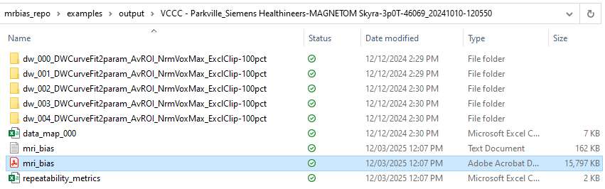

*Authors: James Korte &nbsp;&nbsp;&nbsp;&nbsp;&nbsp;&nbsp;&nbsp;&nbsp;&nbsp;&nbsp;&nbsp;&nbsp;&nbsp;&nbsp;&nbsp;&nbsp;&nbsp;&nbsp;&nbsp;&nbsp;&nbsp;&nbsp;&nbsp;&nbsp;&nbsp;&nbsp;&nbsp;&nbsp;&nbsp;&nbsp;&nbsp;&nbsp;&nbsp;&nbsp;&nbsp;&nbsp;&nbsp;&nbsp;&nbsp;&nbsp;&nbsp;&nbsp;&nbsp;&nbsp;&nbsp;&nbsp;&nbsp;&nbsp;&nbsp;&nbsp;&nbsp;&nbsp;&nbsp;&nbsp;&nbsp;&nbsp;&nbsp;&nbsp;&nbsp;&nbsp;&nbsp;&nbsp;&nbsp;&nbsp;&nbsp;&nbsp;&nbsp;&nbsp;&nbsp;&nbsp;&nbsp;&nbsp;&nbsp;&nbsp;&nbsp;&nbsp;&nbsp;&nbsp;&nbsp;&nbsp;&nbsp;&nbsp;&nbsp;&nbsp;&nbsp;&nbsp; Date Modified: 12/03/2025*

# Tutorial: How to analyse a diffusion dataset
This tutorial demonstrates how to estimate apparent diffusion coefficient (ADC) values from diffusion weighted MR images of a NIST/NCI/RSNA diffusion phantom. The tutorial assumes that you already have MR-BIAS installed and working on your system, [installation instructions can be found here](./how_to_install.md). The tutorial has the following major sections
- [Details of the diffusion dataset](./basic_analysis_diffusion.md#details-of-the-diffusion-dataset)
- [Run the analysis](./basic_analysis_diffusion.md#run-the-analysis)
- [How does the automated analysis work?](./basic_analysis_diffusion.md#how-does-the-automated-analysis-work)
- [Expected output from analysis](./basic_analysis_diffusion.md#expected-output-from-analysis)
- [Running the software on your own data](./basic_analysis_relaxometry.md#running-the-software-on-your-own-data)
<br><br>

## Details of the diffusion dataset
The DICOM dataset used in this tutorial are included in the MR-BIAS repository ([mrbias_testset_C](https://github.com/JamesCKorte/mrbias/tree/main/data/mrbias_testset_C)). The dataset was acquired on a 3T Siemens scanner with the diffusion phantom filled with ice water, and includes the following images:
* A series of diffusion weighted images, for quantification of ADC
* ADC maps as calculated on the MRI scanner console

## Run the analysis
We have provided an example script to analyse the diffusion data. To run this example script, navigate to your cloned version of the MR-BIAS repository, then into the "examples" folder, and launch the script with the following commands:
```
cd examples
python diffusion_example_1.py
```
You should see some text scrolling in your terminal/console window when you run the second command. This is a log of the analysis and provides some realtime feedback of the analysis as it is running. Each line of the log is tagged to let you know the context of the message, for example:
* [INFO] provides general information
* [WARNING] the software has found something slightly out of the ordinary but has been able to continue
* [ERROR] the software has run into something obviously incorrect, missing, and that it may be unable to continue 

The diffusion_example_1.py script will analyse the diffusion dataset, this will take a few minutes depending on your computer specs. While the analysis is running, you can learn a bit more about MR-BIAS, how it processes the images, estimates ADC values, and how to check the analysis has run successfully.

## How does the automated analysis work?
The automated analysis is described in detail in [the original MR-BIAS publication](https://doi.org/10.1088/1361-6560/acbcbb) and in [a presentation at the ESMRMB MRITogether conference (2023)](https://www.youtube.com/watch?v=QgFzDnjO4Jw&list=PLeDygc8TN_J65c0jM0ms__diTMylbEk9l&index=14&t=18m14s). These references focus on a slightly different phantom used for relaxometry, but the analysis steps are essentially identical for the diffusion phantom. The major steps in the analysis (Figure 1) include image sorting, ROI detection, model fitting, and reporting the results. The input to the analysis is a configuration file (.yaml) and a directory of DICOM images to analyse. The output of the analysis is a textual log file, a visual summary of the analysis (.pdf), and a comma separated value file (.csv) of the estimated ADC values. We will provide some guidance in the following sections on how to interpret the log file and the PDF report to check the major steps of the analysis.


<figure>

  <figcaption><b>Figure 1:</b>  <i>The MR-BIAS automated workflow requires two inputs; a directory of images (DICOM format) to analyse and a
configuration file (.yaml format) to control the image analysis. Images are sorted into geometric images for ROI detection and diffusion weighted (DW) image sets for fitting of a apparent diffusion coefficient model. The software has three outputs; a text based log of the analysis, a PDF formatted visual
summary and a comma separated value file of the model fitting results. This figure is taken from the original MR-BIAS publication (https://doi.org/10.1088/1361-6560/acbcbb)</i></figcaption>
</figure>


### Image sorting
To find the datasets required for diffusion analysis the software scans the DICOM directory and extracts image metadata. The extracted meta-data is used to categorise the images into types, such as a geometric image for ROI detection, or a diffusion weighted image series for ADC estimation. The results of this automatic image sorting are summarised in the logfile, the PDF report, and printed to the terminal during execution of the script.

A snippet of the log printed to the terminal (Figure 2) shows a summary of the image sorting for [mrbias_testset_C](https://github.com/JamesCKorte/mrbias/tree/main/data/mrbias_testset_C). The summary table is ordered by series number and displays other information such as the date, time, and description for each series. Each series is detected as a specific category (dw, adc) and images of the same category are grouped together into image sets, for example all the different b-value images of a DW image set. The reference geometry (REF. GEOM) shows which image will be used for ROI detection for each image series. The series UID is also provided for each series in case you want to manually verify the correct images are being analysed.

<figure>
  
  <figcaption><b>Figure 2:</b>  <i>The image sorting summary logged to the terminal during execution of MR-BIAS. Each image series is detected as a category and related image series are also grouped into imagesets (i.e. all the b-value images of a DW dataset). A similar table is also available in the PDF report.</i></figcaption>
</figure>

### ROI detection

The ROI detection for the diffusion phantom is shape based, and uses computer vision techniques to search for landmarks such as circles to determine the location of diffusion vials in the phantom. The PDF report includes a visual summary of the ROI detection (Figure 3). The visual summary includes the template image and template ROIs to cover the individual vials of the diffusion phantom. The detected ROIs are displayed on the geometric image in its native image space (target space) and in the image space of the template image (template space). The axial, sagittal and coronal planes are shown to allow three dimensional assessment. Visual inspection of these images allows us to conclude that the ROI detection looks reasonable as the coloured circles are located within the circular regions of the phantom.
<figure>
  
  <figcaption><b>Figure 3:</b>  <i>a visual summary of the ROI detection performed on a diffusion phantom. The figure includes (top row) axial, (middle row) sagittal, and (bottom row) coronal images. The (left) template used for ROI detection consists of an image and associated ROIs. The (central) detected ROIs are shown on the geometric image, but in the same image space as the template, to assess the ROI detection accuracy. Similarly, the (right) detected ROI are shown on the target geometric image.</i></figcaption>
</figure>
<br><br>

The ROI detection is performed on the geometric image, which in this tutorial is configured to be the first detected diffusion image. The result of the detection process is a rigid transform, which is used to transform the template ROIs onto each image used for model fitting. To check the accuracy of ROI detection, a summary for each image set is provided in the PDF report. An example of this is provided for a diffusion weighted image set (Figure 4). A zoomed view is shown for each ROI, multiple planes (axial and sagittal) are shown for 3D image sets to help visually assess the quality of the ROI detection.
<figure>
  
  <figcaption><b>Figure 4:</b>  <i>A summary of detected ROIs as transformed onto a diffusion weighted image. The target image (greyscale) has an overlay of the detected (colours) regions of interest.</i></figcaption>
</figure>

### Model fitting

The software will fit a signal model, or in this case a model of diffusion, to the measured signal in each region of interest across all images in an imageset. For example, ADC values have been estimated in each ROI of the diffusion weighted imageset using linear regression on a linearised form of an exponential diffusion signal model. A summary table of the estimated ADC values is provided in the PDF report (Figure 5) and is also output in a datafile (.csv) if further analysis is desired. The signal equation is detailed in the PDF report (Figure 5) with a description of the model parameters.
<figure>
  
  <figcaption><b>Figure 5:</b>  <i>A summary table of the estimated parameters of a ADC model on a diffusion weighted image set. The ground truth NMR reference values for ADC, as provided by the phantom manufacturer are show in the column 'ADC_ref'. The signal equation is detailed below the summary table, including descriptions of the model parameters estimated in the linear regression.</i></figcaption>
</figure>
<br><br>

The curves resulting from the model fit are plotted against the measured data (Figure 6) to allow visual inspection of the quality of the curve fit. Here we can see the (coloured line) curve fit is reasonable in comparison to the (coloured dots) measured data from the images. The (black dots) are measurement points which we have manually exlcuded, in this case images with a flip angle of 15 degrees. The (coloured vertical bars on the dots) standard deviation of the measurement within an ROI for each measurement point are also shown.
<figure>
  
  <figcaption><b>Figure 6:</b>  <i>A graphical summary of the signal models as fit to the measured image data for a diffusion weighted image set</i></figcaption>
</figure>
<br><br>

A summary of %bias, the deviation of the measured ADC values in comparison to the NMR reference values provided by the phantom manufacturer (Figure 7) is provided in the PDF report. This provides a quick visual summary of accuracy of estimated ADC values across all ROIs in the phantom.
<figure>
  
  <figcaption><b>Figure 7:</b>  <i>The percentage error between the estimated ADC values and the NMR reference values provided by the phantom manufacturer, or %bias, for each ROI in the diffusion phantom. In this dataset the %bias is  less than 25% across all ROIs in the diffusion phantom.</i></figcaption>
</figure>


## Expected output from analysis
Once the example analysis script has completed running on your computer, you should have a new folder in the directory "examples/output". The folders should have a name starting with "VCCC - Parkville_Siemens Healthineers..." and will have a structure similar to that shown in Figure 8. The output folder includes a PDF report (mri_bias.pdf), a logfile of the analysis (mri_bias.txt), a datamap (data_map_000.csv) to link sequence details to their related model fit directory, and directory for each model fit (dw_000..., dw_001..., dw_002...). 

<figure>
  
  <figcaption><b>Figure 8:</b>  <i>The expected output directory structure after analysis of mrbias_testset_C.</i></figcaption>
</figure>
<br><br>

In each model fit directory we expect two comma separated value (.csv) files to be present (Figure 9). The "model_fit_summary.csv" provides summary metrics for each ROI such as the estimated ADC values and the reference values. The "voxel_data.csv" file contains the measurement data for each voxel in an ROI, for example the diffusion weighted curve across all b-values for every voxel. The voxel data in this file is the processed DICOM data, which means it has had all configured pre-processing steps applied (i.e. normalisation, clipping detection, averaging).
<figure>
  
  <figcaption><b>Figure 9:</b>  <i>The expected files in each model fit directory include a summary of the estimated parameters (model_fit_summary.csv) and the measured data to which the model was fit (voxel_data.csv).</i></figcaption>
</figure>
<br><br>

We recommend that you review the PDF reports generated on your computer, and check that the output for mrbias_testset_C is comparable to the figures in this tutorial.

## Running the software on your own data
To run MR-BIAS on your own dataset we suggest making a copy of the "diffusion_example_1.py" script (below) and naming it "my_diffusion_analysis_script.py". You will then need to modify a few key lines to point the software at your data, set the correct image sorting settings, and define your experimental conditions.
```python
# import required mrbias modules
from mrbias import MRBIAS

# specify the configuration file to control the analysis
configuration_filename = os.path.join("..", os.path.join("config", "diffusion_example_1_config.yaml"))
# specific the dicom directories to analyse[mri_bias.py](..%2Fmrbias%2Fmri_bias.py)
dicom_directory = "..\data\mrbias_testset_C"

# create a MRBIAS analysis object
mrb = MRBIAS(configuration_filename, write_to_screen=True)
# run the analysis (output will be created in the "output_directory" specified in the configuration file)
mrb.analyse(dicom_directory)
```

### Let the software know where to find your dataset
To get the software to analyse a dataset on your computer, you will need to update the 'dicom_directory' variable to the directory that contains your DICOM dataset.
```python
dicom_directory = "..\path_to_your_dicom_directory"
```
### Choose an appropriate image sorting option
The configuration file which controls how MR-BIAS will analyse these datasets is currently specified by the following statement. 
```python
configuration_filename = os.path.join("..", os.path.join("config", "diffusion_example_1_config.yaml"))
```
This configuration file is setup to categorise images acquired on a Siemens 3T scanner with sequence parameters as recommended in the Calibre MRI system phantom manual. If your data was acquired on another scanner from a different manufacturer or with a different set of sequence parameters, then the image sorting may not categorise your DICOM data correctly. If that is the case, there are a number of pre-defined image sorting options which may match your data (Table 1).


|     Image Sorting Setting      |         Scan Session          |      Phantom      | Manufacturer | Field strength | Comments                                |
|:------------------------------:|:-----------------------------:|:-----------------:|:------------:|:--------------:|:----------------------------------------|
|       diff_siemens_skyra       |   diff_siemens_3T_skyra.py    | Diffusion Phantom |   Siemens    |  1.5 T, 3.0 T  | As tested on EMBRACE multi-site dataset |        
|      diff_philips_ingenia      |  diff_philips_3T_ingenia.py   | Diffusion Phantom |   Philips    |     3.0 T      | As tested on EMBRACE multi-site dataset |
| diff_philips_ingenia_ambitionX | diff_philips_1p5T_ingeniaX.py | Diffusion Phantom |   Philips    |     1.5 T      | As tested on EMBRACE multi-site dataset |
|       diff_ge_discovery        |    diff_GE_3T_discovery.py    | Diffusion Phantom |      GE      |     3.0 T      | As tested on EMBRACE multi-site dataset |
|         diff_ge_optima         |     diff_GE_1p5T_optima       | Diffusion Phantom |      GE      |     1.5 T      | As tested on EMBRACE multi-site dataset |

<b>Table 1:</b>  <i>The options for pre-defined image sorting of the NIST/NCI/RSNA diffusion phantom.</i>

To select another option, such as 'diff_ge_discovery', we suggest you make a copy of 'diffusion_example_1_config.yaml' and call it something like 'my_config.yaml'. You will need to update your script to use this new configuration file with the following statement:
```python
configuration_filename = os.path.join("..", os.path.join("config", "my_config.yaml"))
```
In your file 'my_config.yaml' you will then need to update the block of settings which are responsible for file sorting
```
# ====================================================================================================================
# DICOM sorting options
# ====================================================================================================================
dicom_sorting:
  scan_protocol : "diff_siemens_skyra"   # options include [diff_siemens_skyra, diff_philips_ingenia, diff_philips_ingenia_ambitionX, diff_ge_discovery, diff_ge_optima]
  scan_protocol_options: ["diff_siemens_skyra", "diff_philips_ingenia", "diff_philips_ingenia_ambitionX", "diff_ge_discovery", "diff_ge_optima"]
```
to use the 'diff_ge_discovery' option update the 'scan_protocol' line to be the following
```
scan_protocol : "diff_ge_discovery" 
```
If the available sorting options are not suitable for your dataset, then please refer to our tutorial on [adding a new scanner or acquisition protocol](./adding_a_new_scanner.md) or [contact us](./contact.md) for assistance.

### Define the relevant experimental conditions
Some quantitative parameters, such as ADC values, are temperature dependant. To ensure the software is comparing your measurements to the correct measurement values, you will need to check or update the experimental conditions used during the acquisition of your image data. The field strength and temperature are defined in the following section of the configuration file
```
# ====================================================================================================================
# PHANTOM/EXPERIMENT configuration
# ====================================================================================================================
phantom_experiment:
  phantom_manufacturer: "caliber_mri" # options include [caliber_mri]
  phantom_type: "diffusion_phantom"      # options include [system_phantom, diffusion_phantom]
  phantom_serial_number: "128-0155"   # for CalibreMRI phantoms SN has format XXX-XXXX
  field_strength_tesla: 3.0           # options include [1.5, 3.0]
  temperature_celsius: 0.0          # will match to closest experimental reference data
```

### Run your analysis
Now that you have created and updated your own analysis script and configuration file, you can run the analysis with the following command
```
python my_diffusion_analysis_script.py
```

## Concluding remarks
You have now run your first diffusion analysis with MR-BIAS, if you had any issues with the example script please [contact us](./contact.md). We hope the tutorial has given you an overview of the basic workflow of the automated analysis, and how you can use the PDF report and the log files to check the analysis is valid, and to view the estimated ADC values. 

A tutorial which may now be of interest is [how to customise the analysis settings by writing your own configuration file](./writing_a_config_file.md). Alternatively, please refer to the [main tutorial page](./tutorials.md) for help on other topics.

<br> <br> <br> <br> <br> <br>

### Revision history

|     Date      |   Author    | Changes                                 |
|:-------------:|:-----------:|:----------------------------------------|
| 12 March 2025 | James Korte | Created introductory diffusion tutorial |


