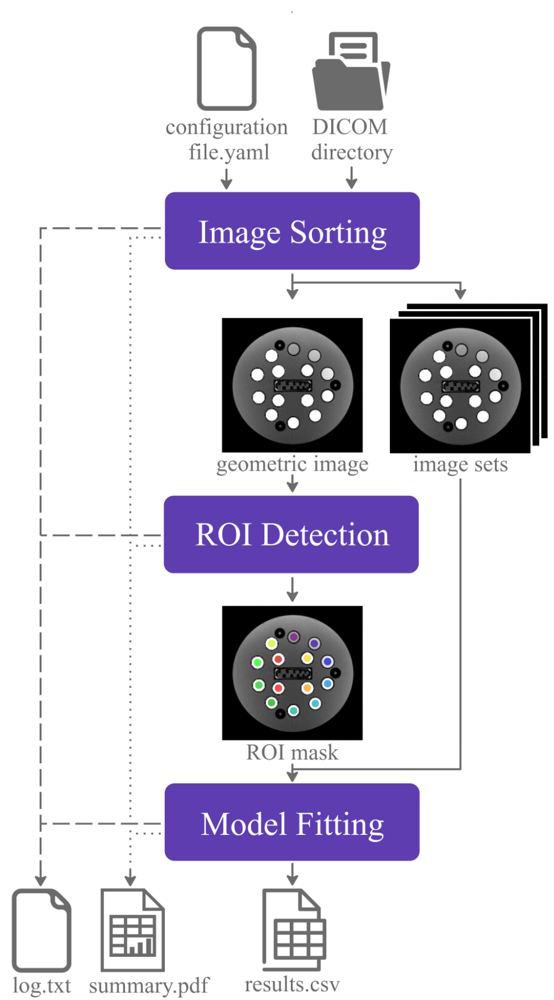
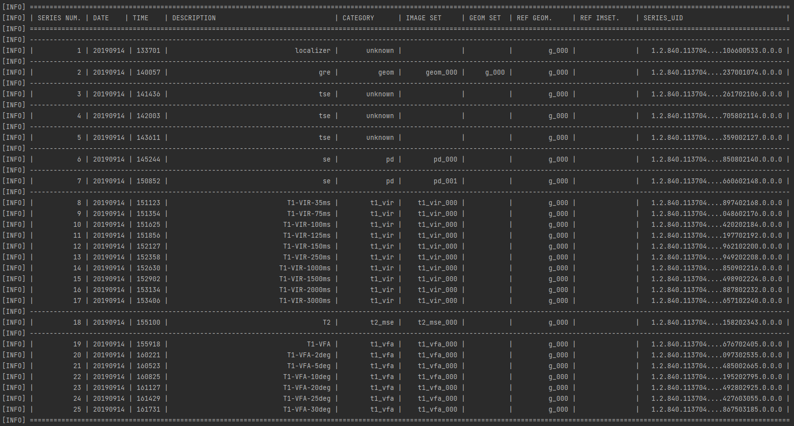
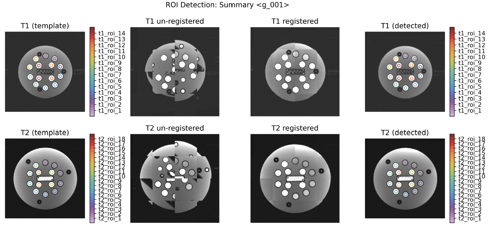
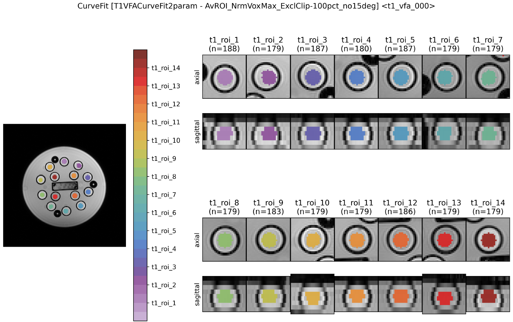
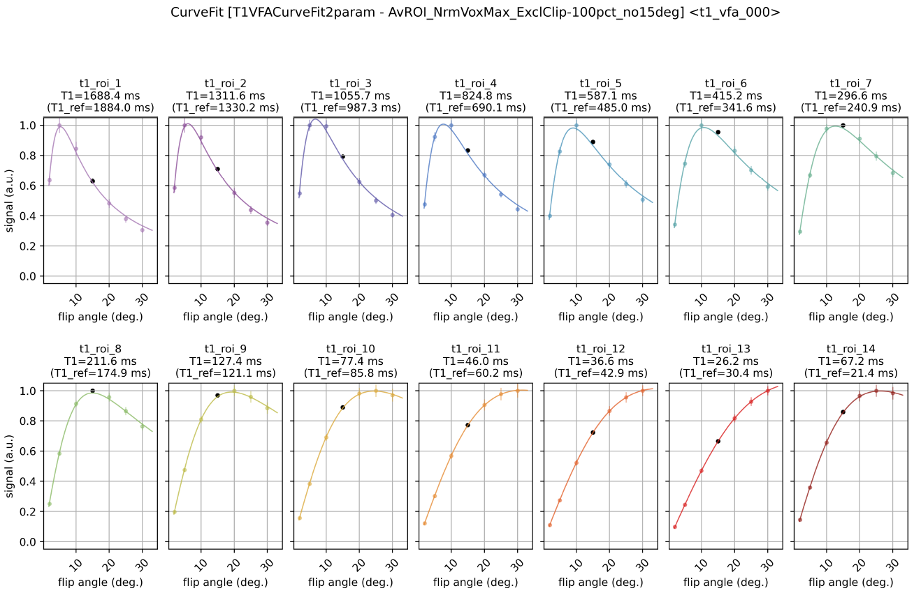
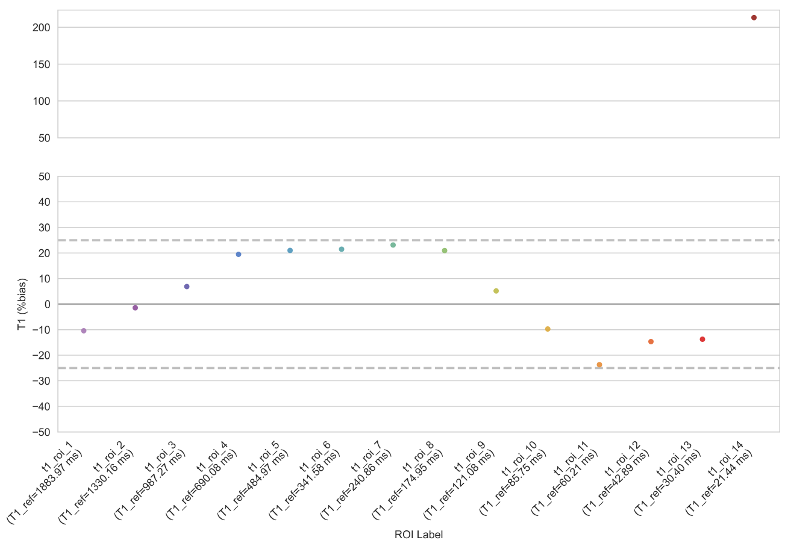
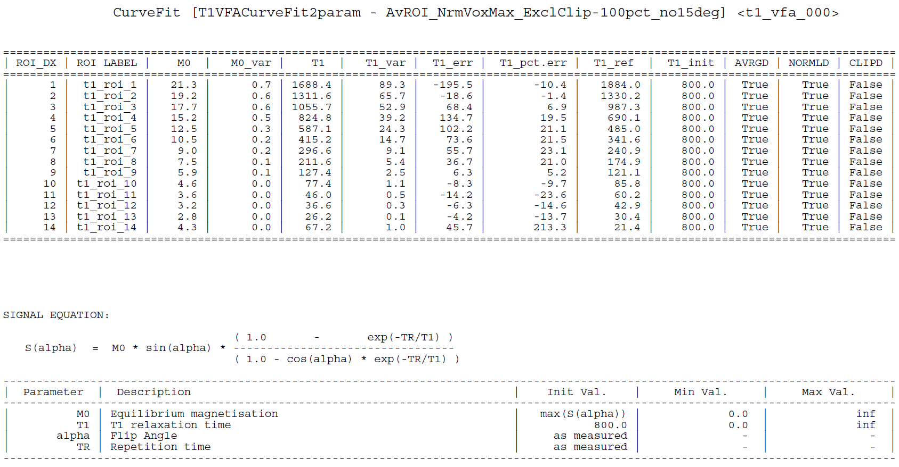
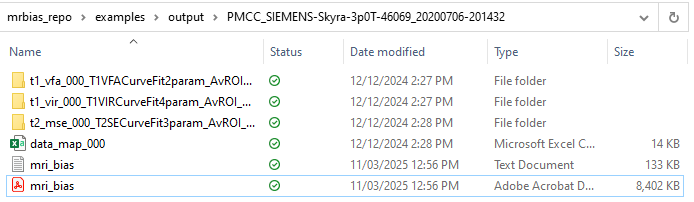
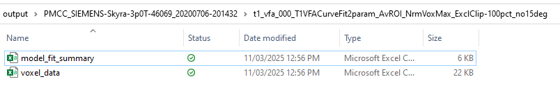

*Authors: James Korte &nbsp;&nbsp;&nbsp;&nbsp;&nbsp;&nbsp;&nbsp;&nbsp;&nbsp;&nbsp;&nbsp;&nbsp;&nbsp;&nbsp;&nbsp;&nbsp;&nbsp;&nbsp;&nbsp;&nbsp;&nbsp;&nbsp;&nbsp;&nbsp;&nbsp;&nbsp;&nbsp;&nbsp;&nbsp;&nbsp;&nbsp;&nbsp;&nbsp;&nbsp;&nbsp;&nbsp;&nbsp;&nbsp;&nbsp;&nbsp;&nbsp;&nbsp;&nbsp;&nbsp;&nbsp;&nbsp;&nbsp;&nbsp;&nbsp;&nbsp;&nbsp;&nbsp;&nbsp;&nbsp;&nbsp;&nbsp;&nbsp;&nbsp;&nbsp;&nbsp;&nbsp;&nbsp;&nbsp;&nbsp;&nbsp;&nbsp;&nbsp;&nbsp;&nbsp;&nbsp;&nbsp;&nbsp;&nbsp;&nbsp;&nbsp;&nbsp;&nbsp;&nbsp;&nbsp;&nbsp;&nbsp;&nbsp;&nbsp;&nbsp;&nbsp;&nbsp; Date Modified: 11/03/2025*

# Tutorial: How to analyse a relaxometry dataset
This tutorial demonstrates how to estimate T<sub>1</sub> and T<sub>2</sub> relaxation times from MR images of a ISMRM/NIST system phantom. The tutorial assumes that you alread have MR-BIAS installed and working on your system, [installation instructions can be found here](./how_to_install.md). 

## Details of relaxometry datasets
The DICOM datasets used in this tutorial are included in the MR-BIAS repository ([mrbias_testset_A](https://github.com/JamesCKorte/mrbias/tree/main/data/mrbias_testset_A), [mrbias_testset_B](https://github.com/JamesCKorte/mrbias/tree/main/data/mrbias_testset_B)). The two datasets were acquired on a 3T Siemens scanner with the system phantom at room temperature, and include the following images:
* A geometric image, which is used for region of interest (ROI) detection 
* A series of images with variable flip angles (VFA), for quantification of T<sub>1</sub> relaxation times
* A series of images with variable inversion recovery times (VIR), for quantification of T<sub>1</sub> relaxation times
* A series of images taken at multiple spin-echo times (MSE), for quantification of T<sub>2</sub> relaxation times

## Run the analysis
We have provided an example script to analyse the relaxometry data. To run this example script, navigate to your cloned version of the MR-BIAS repository, then into the "examples" folder, and launch the script with the following commands:
```
cd examples
python relaxometry_example_1.py
```
You should see some text scrolling in your terminal/console window when you run the second command. This is a log of the analysis and provides some realtime feedback of the analysis as it is running. Each line of the log is tagged to let you know the context of the message, for example:
* [INFO] provides general information
* [WARNING] the software has found something slightly out of the ordinary but has been able to continue
* [ERROR] the software has run into something obviously incorrect, missing, and that it may be unable to continue 

The relaxometry_example_1.py script will sequentially analyse the two datasets, this will take a few minutes depending on your computer specs. While the analysis is running, you can learn a bit more about how MR-BIAS, how it processes the images, estimates relaxometry times, and how to check the analysis has run successfully.

## How does the automated analysis work?
The automated analysis is described in detail in [the original MR-BIAS publication](https://doi.org/10.1088/1361-6560/acbcbb). The major steps in the analysis (Figure 1) include image sorting, ROI detection, model fitting, and reporting the results. The input to the analysis is a configuration file (.yaml) and a directory of DICOM images to analyse. The output of the analysis is a textual log file, a visual summary of the analysis (.pdf), and a comma separated value file (.csv) of the estimated T<sub>1</sub> and T<sub>2</sub> times. We will provide some guidance in the following sections, on how to interpret the log file and the PDF report to check the major steps of the analysis.


<figure>

  <figcaption><b>Figure 1:</b> The MR-BIAS automated workflow requires two inputs; a directory of images(DICOM format) to analyse and a
configuration file (.yaml format) to control the image analysis. Images are sorted into geometric images for ROI detection and T<sub>1</sub> and
T<sub>2</sub> image sets for fitting of relaxation models. The software has three outputs; a text based log of the analysis, a PDF formatted visual
summary and a comma separated value file of the model fitting results.</figcaption>
</figure>


### Image sorting
To find the datasets required for relaxometry analysis the software scans the DICOM directory and extracts image metadata. The extracted meta-data is used to categorise the images into types, such as a geometric image for ROI detection, of a T<sub>1</sub> VFA series for relaxation rate estimation. The results of this automatic image sorting are summarised in the logfile, the PDF report, and printed to the terminal during execution of the script.

A snippet of the log printed to the terminal (Figure 2) shows a summary of the image sorting for [mrbias_testset_A](https://github.com/JamesCKorte/mrbias/tree/main/data/mrbias_testset_A). The summary table is ordered by series number and displays other information such as the date, time, and description for each series. Each series is detected as a specific category (geometric, t1_vir, t1_vfa, t2_mse) and images of the same category are grouped together into image sets, for example all the different flip angle images of a VFA image set. The reference geometry (REF. GEOM) shows which geometry image will be used for ROI detection for each image series. The series UID is also provided for each series in case you want to manually verify the correct images are being analysed.

<figure>
  
  <figcaption><b>Figure 2:</b> The image sorting summary logged to the terminal during executution of MR-BIAS. Each image series is detected as a category and related image series are also grouped into imagesets (i.e. all the flip angle images of a VFA dataset). A similar table is also available in the PDF report.</figcaption>
</figure>

### ROI detection

TODO: describe what is shown in the summary ROI detection page

<figure>
  
  <figcaption><b>Figure 3:</b> TODO.</figcaption>
</figure>

TODO: describe what is shown in the details ROI detection page

<figure>
  
  <figcaption><b>Figure 4:</b> TODO.</figcaption>
</figure>

### Model fitting

TODO: describe the curve fit visualisations

<figure>
  
  <figcaption><b>Figure 5:</b> TODO.</figcaption>
</figure>

TODO: describe the curve fit bias graph

<figure>
  
  <figcaption><b>Figure 6:</b> TODO.</figcaption>
</figure>

TODO: describe the curve fit numerical table and equation details

<figure>
  
  <figcaption><b>Figure 7:</b> TODO.</figcaption>
</figure>

## Expected output from analysis

TODO: describe the output directory structure

<figure>
  
  <figcaption><b>Figure 8:</b> TODO.</figcaption>
</figure>

TODO: describe the output numerical files for the VFA model fit

<figure>
  
  <figcaption><b>Figure 9:</b> TODO.</figcaption>
</figure>


## Concluding remarks
You have now run your first relaxometry analysis with MR-BIAS, if you had any issues with the example script please [contact us](./contact.md). We hope the tutorial has given you an overview of the basic workflow of the automated analysis, and how you can use the PDF report and the log files to check the analysis is valid, and to view the estimated relaxation rates. 

The following tutorials will help you get started with analysis of your own data
* [Running the software on your own dataset](./run_it_on_your_own_data.md)
* [Customising the analysis settings by writing your own configuration file](./writing_a_config_file.md)

 <br> <br> <br> <br> <br> <br>

### Revision history

|     Date      |   Author    | Changes                            |
|:-------------:|:-----------:|:-----------------------------------|
| 11 March 2025 | James Korte | Created basis relaxometry tutorial |


